# OVN Network Agent - C4 Architecture

## Table of Contents
1. [C4 Model Overview](#c4-model-overview)
2. [Level 1: System Context](#level-1-system-context)
3. [Level 2: Container View](#level-2-container-view)
4. [Level 3: Component View](#level-3-component-view)
5. [Level 4: Code View](#level-4-code-view)

---

## C4 Model Overview

The C4 model is a simple way to model software architecture at different levels of abstraction:

- **Level 1: System Context** - Big picture view of the system and its environment
- **Level 2: Container View** - Containers (applications, data stores, etc.) within the system
- **Level 3: Component View** - Components within each container
- **Level 4: Code View** - Detailed design of key components

---

## Level 1: System Context

### System Context Diagram

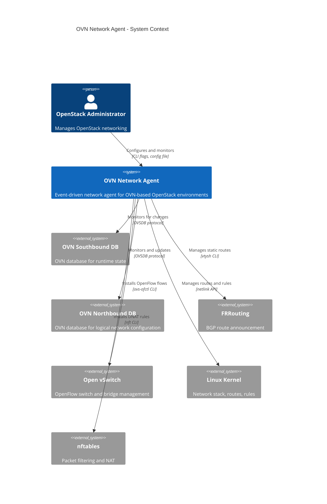

### System Context Description

**OVN Network Agent** is an event-driven daemon that synchronizes network state between OVN databases and the local system. It runs on each compute node in an OpenStack deployment using OVN for networking.

**External Systems:**

1. **OVN Southbound DB** - Contains runtime state including port bindings and chassis information
2. **OVN Northbound DB** - Contains logical network configuration including NAT entries and routers
3. **FRRouting** - BGP daemon for route announcement to external networks
4. **Open vSwitch** - Software switch providing OpenFlow capabilities
5. **Linux Kernel** - Provides network stack, routing, and packet processing
6. **nftables** - Packet filtering and NAT framework

**Key Interactions:**

- Monitors OVN databases for real-time changes
- Installs kernel routes for Floating IPs and SNAT IPs
- Manages FRR static routes for BGP announcement
- Installs OpenFlow flows on provider bridge
- Configures nftables for port forwarding (DNAT)

---

## Level 2: Container View

### Container Diagram

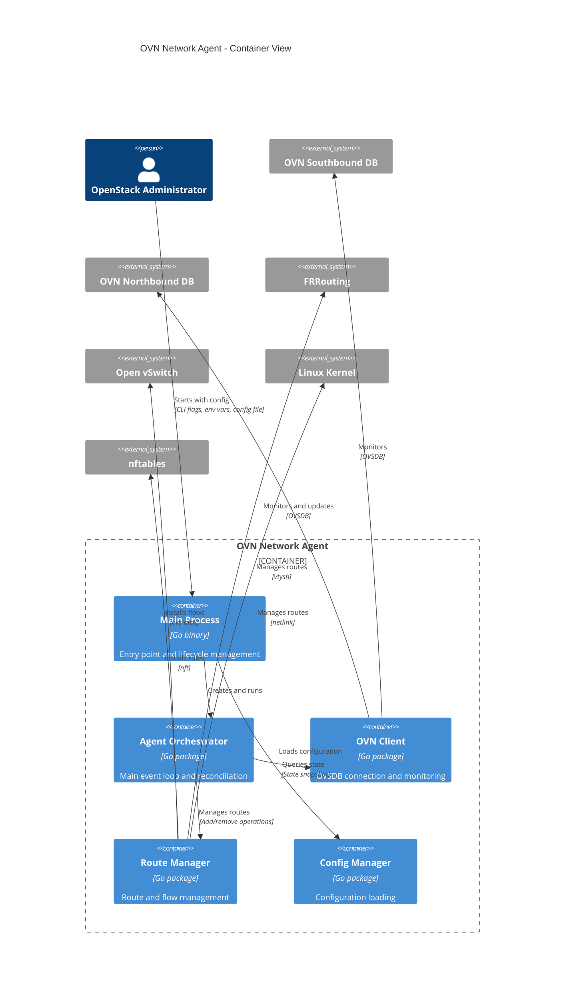

### Container Descriptions

#### Main Process
- **Technology**: Go binary
- **Responsibilities**:
  - Configuration loading and validation
  - Logging setup
  - Signal handling (SIGINT, SIGTERM)
  - Agent lifecycle management
  - Graceful shutdown coordination

#### Agent Orchestrator
- **Technology**: Go package ([`agent.go`](../agent.go))
- **Responsibilities**:
  - Main event loop with reconciliation
  - Bridge device setup
  - Veth leak and port forwarding setup
  - Stale chassis cleanup
  - Gateway drain on shutdown
  - Periodic reconciliation (default 60s)

#### OVN Client
- **Technology**: Go package ([`ovn.go`](../ovn.go))
- **Responsibilities**:
  - OVSDB connection management
  - Database monitoring and event handling
  - State refresh and caching
  - OVN NB operations (routes, MAC bindings)
  - Debouncing of rapid changes

#### Route Manager
- **Technology**: Go package ([`routing.go`](../routing.go))
- **Responsibilities**:
  - Kernel route management (via netlink)
  - FRR route management (via vtysh)
  - OVS flow management
  - Veth leak setup and reconciliation
  - Port forwarding setup

#### Config Manager
- **Technology**: Go package ([`config.go`](../config.go))
- **Responsibilities**:
  - Configuration loading from multiple sources
  - Priority: CLI flags > env vars > config file > defaults
  - Validation of configuration values
  - Port forwarding rule parsing

---

## Level 3: Component View

### Component Diagram - Agent Orchestrator

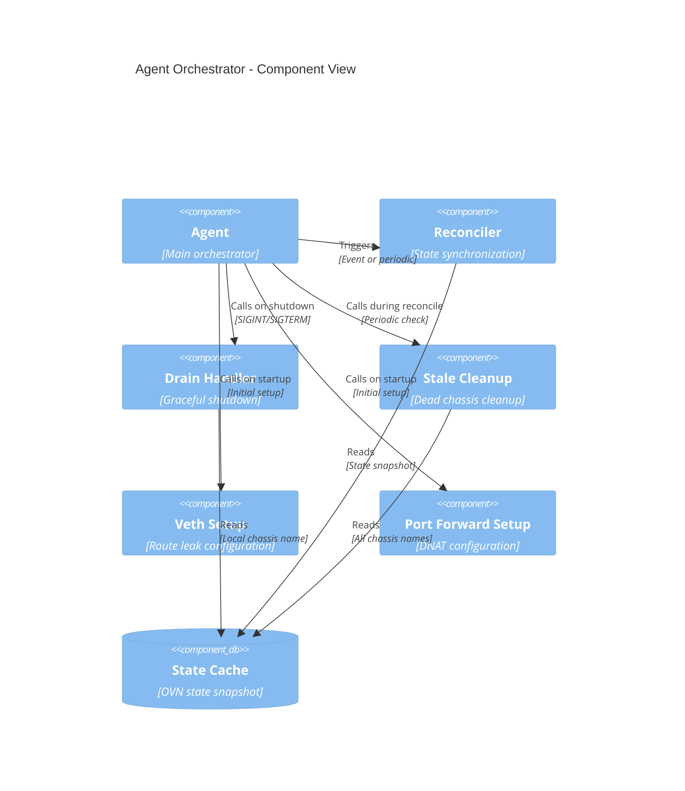

### Component Diagram - OVN Client

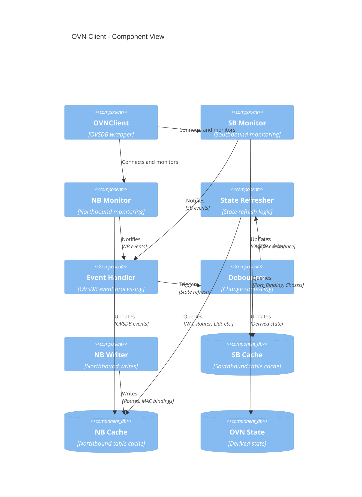

### Component Diagram - Route Manager

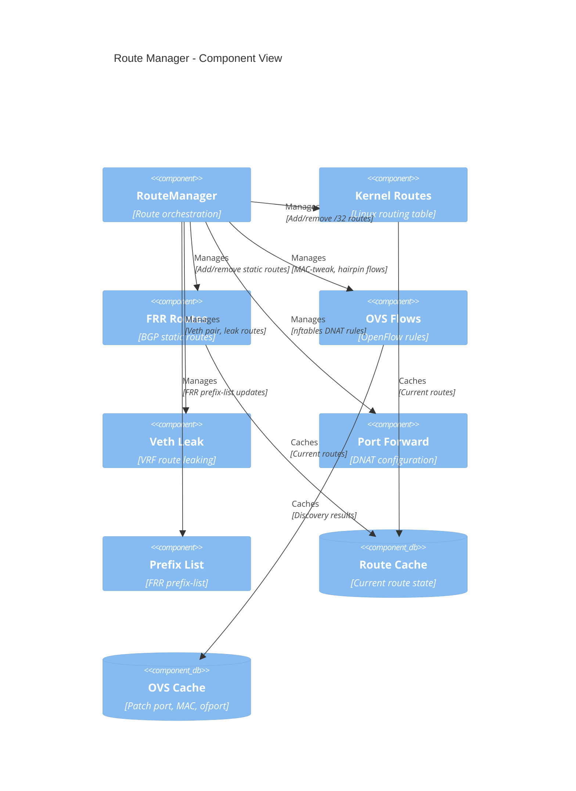

### Component Descriptions

#### Agent Orchestrator Components

**Reconciler**
- Synchronizes local state with OVN state
- Compares desired vs actual routes
- Triggers add/remove operations
- Performs post-change verification

**Drain Handler**
- Lowers gateway chassis priority on shutdown
- Waits for migration to standby chassis
- Coordinates with graceful shutdown

**Stale Cleanup**
- Tracks missing chassis
- Waits for grace period (default 5m)
- Removes OVN NB entries from dead chassis
- Adds random jitter to prevent thundering herd

**Veth Setup**
- Creates veth pair for route leaking
- Configures VRF membership
- Sets up static neighbor entries
- Installs default route in leak table

**Port Forward Setup**
- Configures nftables DNAT rules
- Sets up conntrack zones
- Configures policy routing with fwmarks
- Installs masquerade rules

#### OVN Client Components

**SB Monitor**
- Connects to OVN Southbound DB
- Monitors Port_Binding and Chassis tables
- Detects chassisredirect changes (fast failover)
- Updates SB cache

**NB Monitor**
- Connects to OVN Northbound DB
- Monitors NAT, Logical_Router, LRP tables
- Updates NB cache
- Triggers state refresh on changes

**State Refresher**
- Queries both databases
- Builds derived state
- Maps chassisredirect → LRP → Router → NAT
- Extracts SNAT IPs from SB gateway ports
- Updates OVN state atomically

**Event Handler**
- Processes OVSDB events
- Distinguishes chassisredirect (immediate) vs other (debounced)
- Triggers state refresh

**Debouncer**
- Coalesces rapid changes
- 500ms debounce for state refresh
- 100ms debounce for reconciliation
- Bypasses debounce for chassisredirect

**NB Writer**
- Writes to OVN Northbound DB
- Manages default routes
- Manages static MAC bindings
- Manages gateway chassis priorities

#### Route Manager Components

**Kernel Routes**
- Manages /32 routes on br-ex
- Uses netlink API
- Supports custom routing tables
- Manages policy rules

**FRR Routes**
- Manages static routes in VRF
- Uses vtysh CLI
- Batched operations (500 per call)
- Announced via BGP

**OVS Flows**
- Installs MAC-tweak flows (priority 900)
- Installs hairpin flows (priority 910)
- Discovers patch port and ofport
- Caches bridge MAC

**Veth Leak**
- Creates veth pair (veth-default, veth-provider)
- Places veth-provider in VRF
- Manages per-network leak routes
- Manages policy rules

**Port Forward**
- Configures nftables DNAT rules
- Supports sticky load balancing (jhash)
- Manages conntrack zones
- Configures masquerade rules

**Prefix List**
- Updates FRR prefix-list
- Adds permit entries for discovered networks
- Format: `permit <network> ge 32 le 32`

---

## Level 4: Code View

### Code View - State Refresh

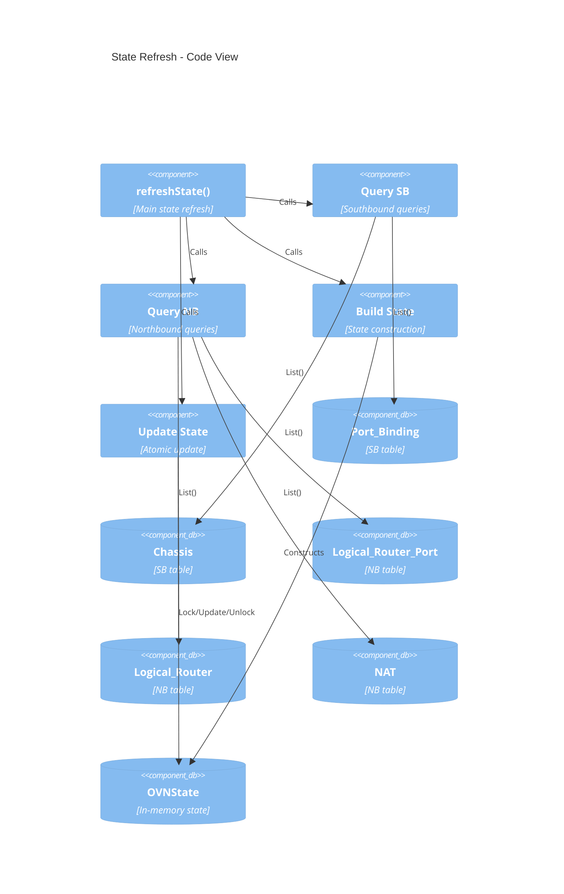

### Code View - Reconciliation

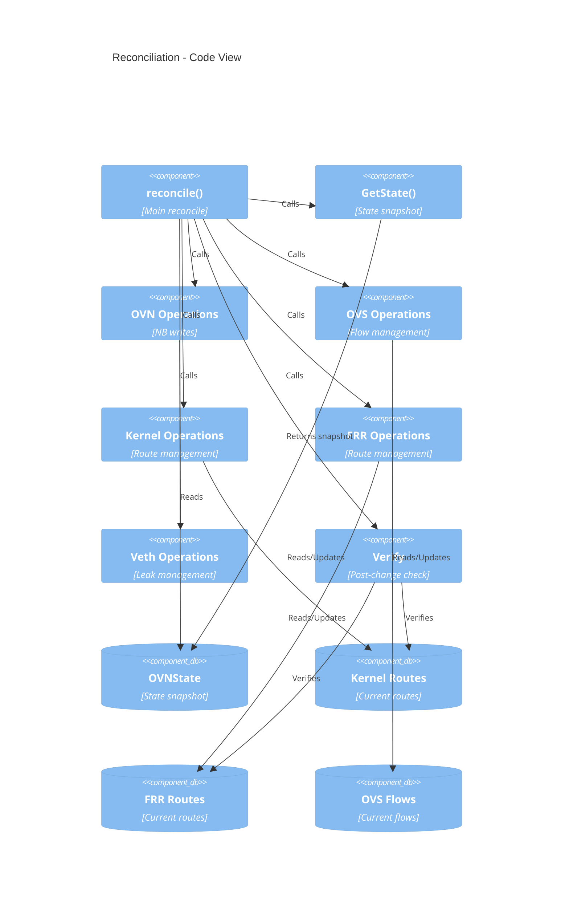

### Code View - Event Handling

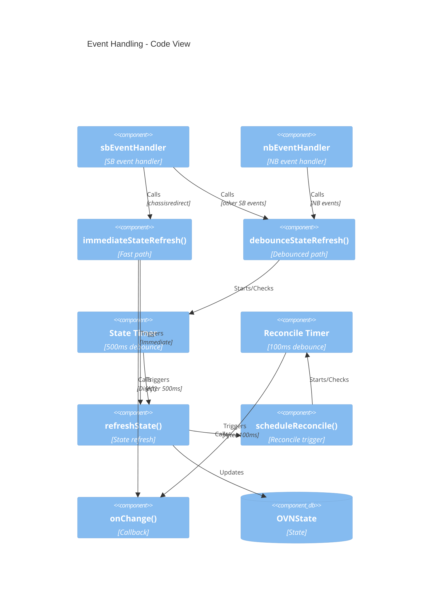

### Key Code Structures

#### OVNState Structure

```go
type OVNState struct {
    mu                 sync.RWMutex
    LocalChassisName   string              // Local hostname
    LocalRouters       []LocalRouterInfo   // Active routers
    HasLocalRouters    bool
    FIPs               []string            // Floating IPs
    SNATIPs            []string            // SNAT IPs
    NATIPToRouterMAC   map[string]string   // IP → Router MAC
    DiscoveredNetworks []*net.IPNet        // Auto-discovered CIDRs
    AllChassisNames    map[string]bool     // All chassis in SB
}
```

#### LocalRouterInfo Structure

```go
type LocalRouterInfo struct {
    RouterName  string   // NB Logical_Router name
    RouterUUID  string   // NB Logical_Router UUID
    LRPName     string   // NB Logical_Router_Port name
    LRPUUID     string   // NB Logical_Router_Port UUID
    LRPMAC      string   // NB Logical_Router_Port MAC
    LRPNetworks []string // NB Logical_Router_Port networks
    CRPort      string   // SB chassisredirect logical_port
}
```

#### RouteManager Structure

```go
type RouteManager struct {
    bridgeDev            string
    vrfName              string
    vethNexthop          string
    routeTableID         int
    ovsWrapper           []string
    dryRun               bool
    vethLeakEnabled      bool
    vethProviderIP       string
    vethLeakTableID      int
    vethLeakRulePriority int
    networkFilters       []*net.IPNet
    frrPrefixList        string
    portForwardEnabled   bool
    portForwardDev       string
    portForwardTableID   int
    portForwardL3mdevAccept bool
    portForwardCTZone    int
    portForwards         []PortForwardVIP
    cachedPatchPort      string
    cachedOfport         string
    cachedBridgeMAC      string
}
```

### Key Algorithms

#### State Refresh Algorithm

```
1. Query SB Port_Binding table
2. Query SB Chassis table
3. Build chassisHostname map
4. Find local chassisredirect ports
5. Query NB Logical_Router_Port table
6. Build LRP name → UUID map
7. Resolve local LRP UUIDs
8. Query NB Logical_Router table
9. Find routers with local LRPs
10. Build LocalRouterInfo list
11. Extract discovered networks from LRP networks
12. Query NB NAT table
13. Filter NAT entries to local routers
14. Extract SNAT IPs from SB gateway patch ports
15. Update OVNState atomically
```

#### Reconciliation Algorithm

```
1. Get OVN state snapshot
2. Compute effective network filters
3. Build hairpin MAC map
4. Ensure OVN NB default routes
5. Ensure OVN NB static MAC bindings
6. Ensure active priority lead
7. Ensure OVS MAC-tweak flows
8. Reconcile OVS hairpin flows
9. List current kernel routes
10. Add missing kernel routes
11. Remove stale kernel routes
12. List current FRR routes
13. Add missing FRR routes (batched)
14. Remove stale FRR routes (batched)
15. Reconcile veth leak networks
16. Reconcile FRR prefix-list
17. Check stale chassis
18. Verify routes installed
```

#### Event Debouncing Algorithm

```
On OVSDB event:
  IF chassisredirect change:
    Cancel pending state timer
    Trigger immediate state refresh
    Trigger direct reconcile
  ELSE:
    IF no state timer pending:
      Start 500ms state timer

On state timer expiry:
  Refresh state
  Start 100ms reconcile timer

On reconcile timer expiry:
  Trigger reconcile
```

---

## Deployment Architecture

### Deployment Diagram

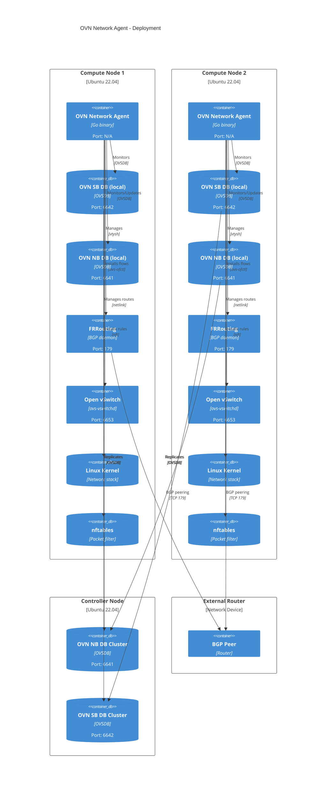

### Deployment Notes

**Compute Nodes:**
- Run OVN Network Agent as systemd service
- Each agent monitors local OVN databases
- Agents coordinate via OVN databases (no direct communication)
- Gateway failover handled via OVN chassisredirect

**Controller Nodes:**
- Host OVN database clusters
- Provide high availability for OVN state
- Agents connect to cluster endpoints

**External Router:**
- BGP peer for route announcement
- Receives FIP/SNAT routes from FRR
- Provides external connectivity

---

## Data Flow

### Data Flow Diagram

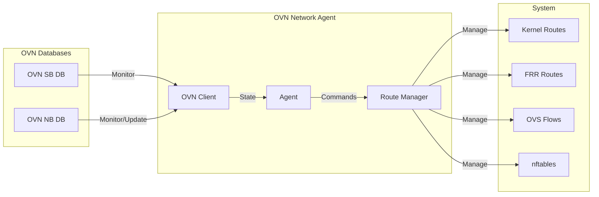

### Data Flow Description

1. **Monitoring Flow**: OVN Client monitors SB and NB databases for changes
2. **State Flow**: OVN Client builds derived state and provides to Agent
3. **Command Flow**: Agent issues commands to Route Manager based on state
4. **Management Flow**: Route Manager manages routes, flows, and rules in system

---

## Security Considerations

### Security Diagram

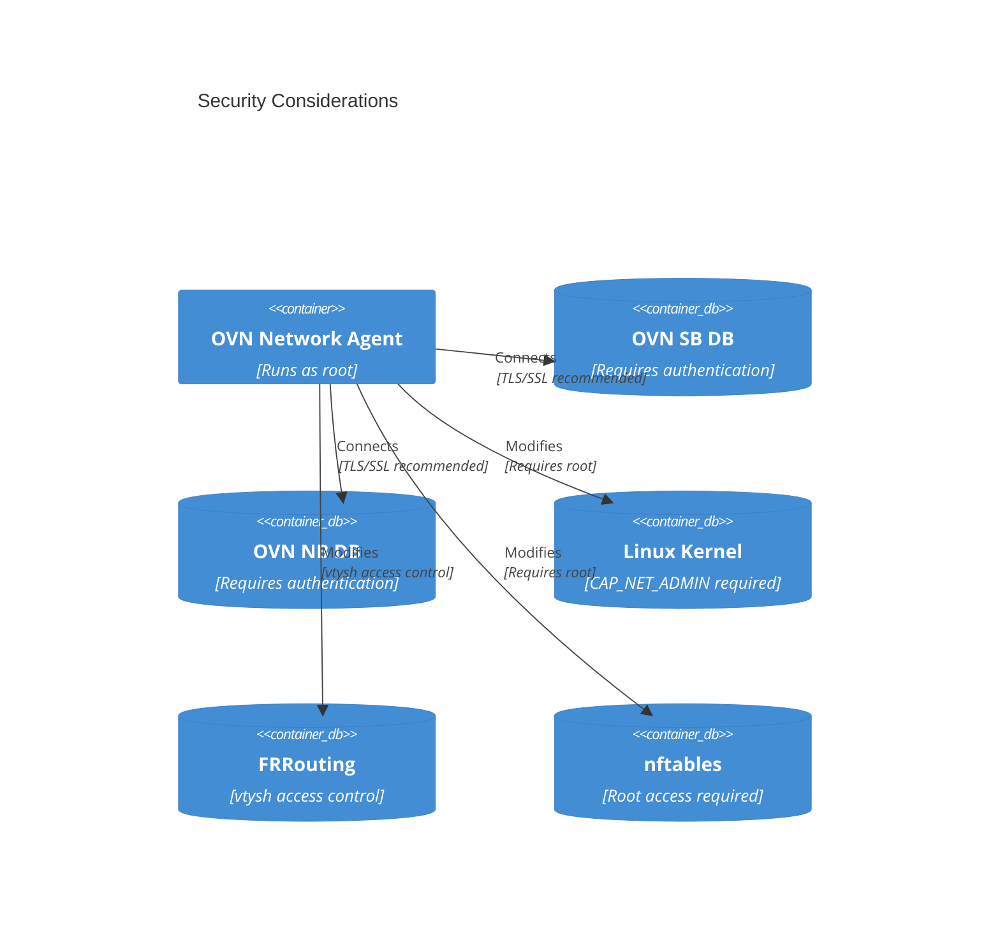

### Security Notes

1. **Privilege Requirements**: Must run as root (CAP_NET_ADMIN)
2. **Network Exposure**: Listens on OVSDB connections
3. **Configuration**: Sensitive data in config file (DB endpoints)
4. **nftables**: Rules affect system-wide packet processing
5. **VRF Access**: Can modify VRF routing tables
6. **TLS/SSL**: Recommended for OVSDB connections

---

## Performance Characteristics

### Performance Diagram

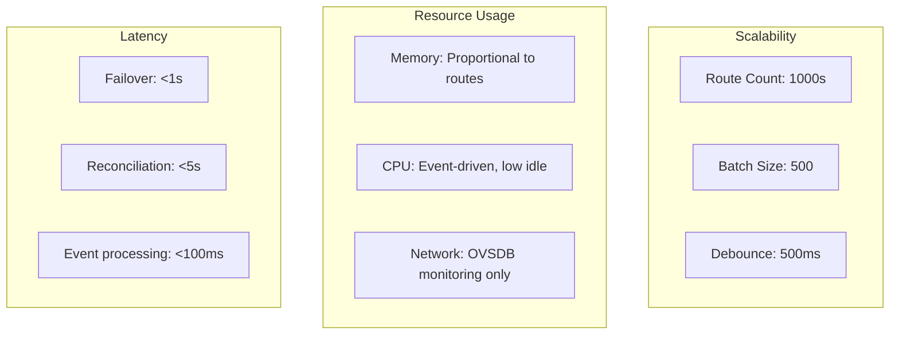

### Performance Notes

- **Scalability**: Tested with thousands of FIPs
- **Batch Operations**: FRR routes batched (500 per call)
- **Debouncing**: Coalesces rapid changes
- **Efficient Queries**: OVSDB monitoring with incremental updates
- **Memory**: Proportional to route count
- **CPU**: Event-driven, low idle usage
- **Network**: OVSDB monitoring traffic only
- **Failover**: <1s for chassisredirect changes
- **Reconciliation**: <5s for full cycle
- **Event Processing**: <100ms per event

---

## Monitoring and Observability

### Monitoring Diagram

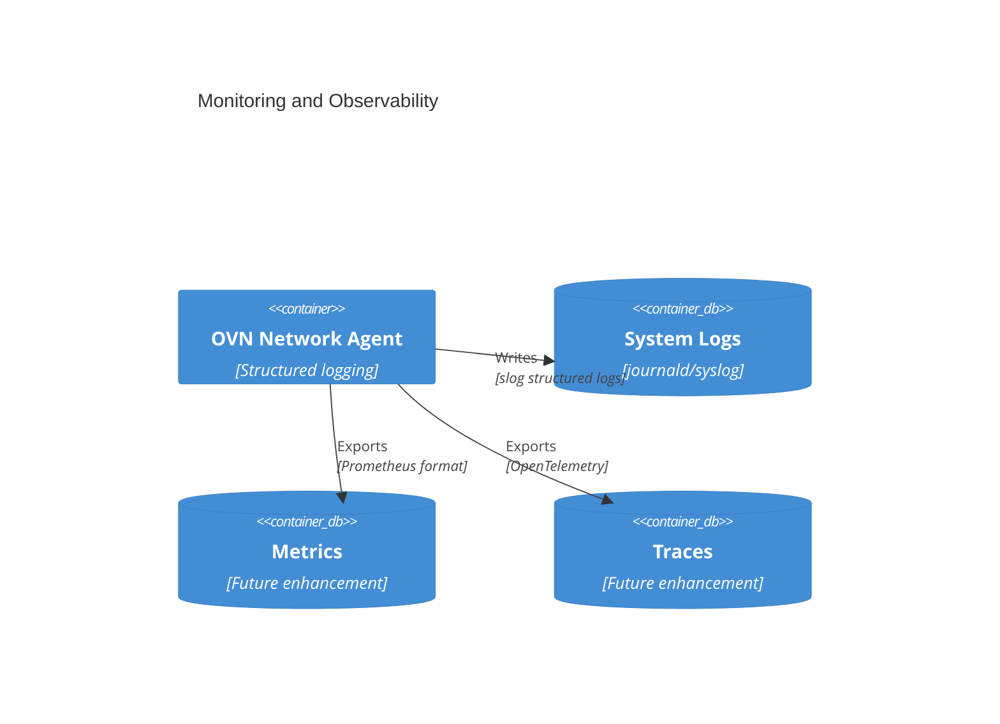

### Observability Notes

**Current:**
- Structured logging with slog
- Log levels: debug, info, warn, error
- Dry-run mode for testing

**Future Enhancements:**
- Prometheus metrics
- OpenTelemetry tracing
- Health check endpoints
- Performance profiling

---

## Troubleshooting Guide

### Troubleshooting Flow

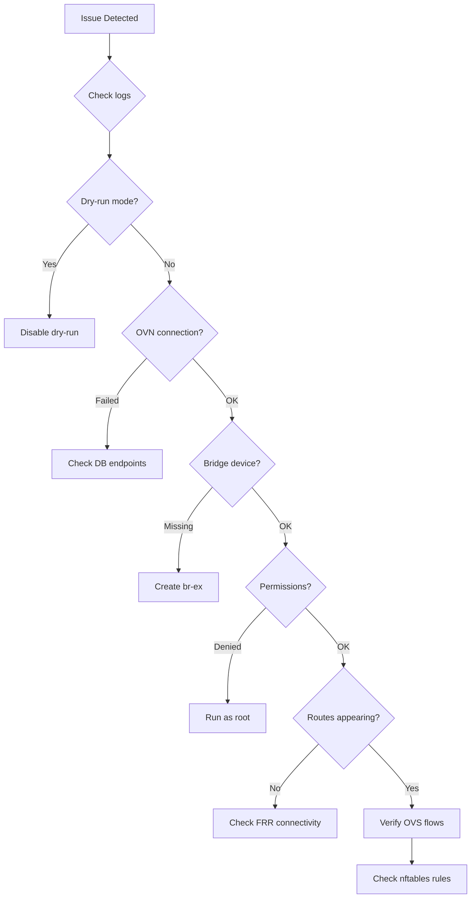

### Common Issues

1. **Routes not appearing**: Check `dry_run` mode
2. **OVN connection failed**: Verify DB endpoints
3. **Bridge device missing**: Ensure `br-ex` exists
4. **Permission denied**: Run as root
5. **FRR routes not syncing**: Check vtysh connectivity

### Debug Commands

```bash
# Enable debug logging
ovn-network-agent --log-level debug

# Dry run mode
ovn-network-agent --dry-run

# Check systemd status
systemctl status ovn-network-agent

# View logs
journalctl -u ovn-network-agent -f
```
