# OVN Network Agent - Flow Diagrams

## Table of Contents
1. [Startup Flow](#startup-flow)
2. [Reconciliation Flow](#reconciliation-flow)
3. [Event Handling Flow](#event-handling-flow)
4. [Route Synchronization Flow](#route-synchronization-flow)
5. [Gateway Failover Flow](#gateway-failover-flow)
6. [Port Forwarding Flow](#port-forwarding-flow)
7. [Graceful Shutdown Flow](#graceful-shutdown-flow)
8. [Stale Chassis Cleanup Flow](#stale-chassis-cleanup-flow)

---

## Startup Flow

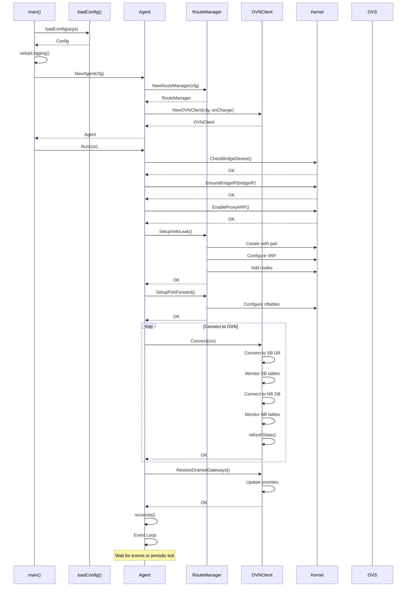

---

## Reconciliation Flow

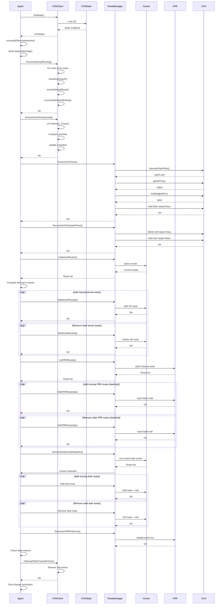

---

## Event Handling Flow

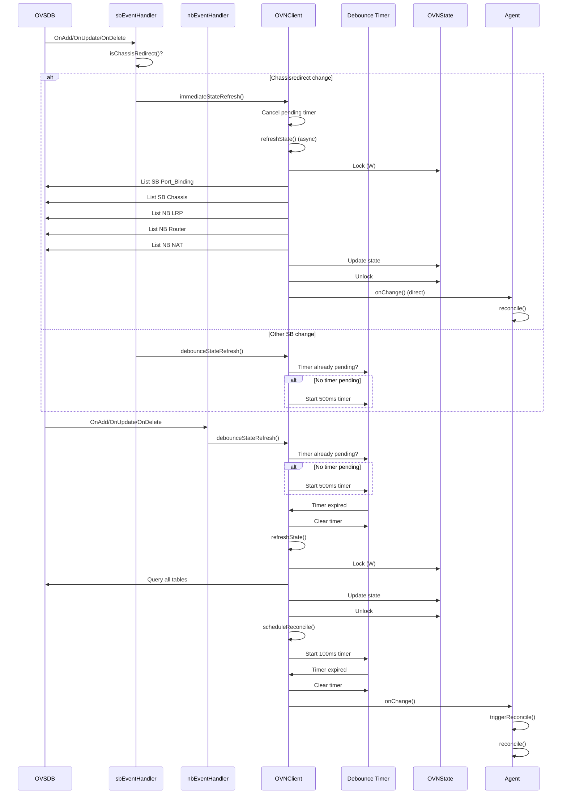

---

## Route Synchronization Flow

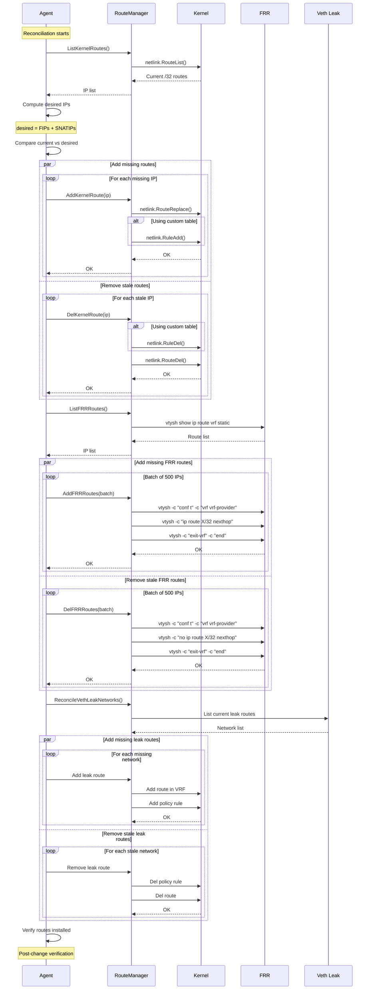

---

## Gateway Failover Flow

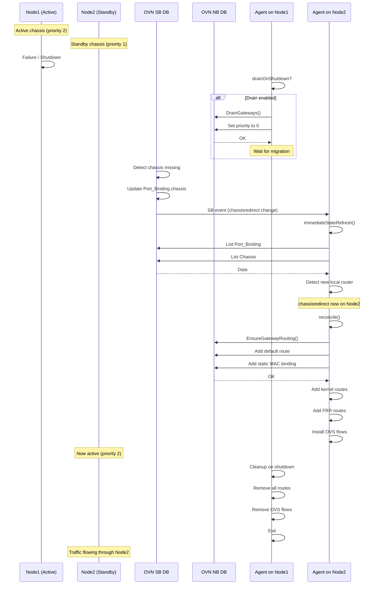

---

## Port Forwarding Flow

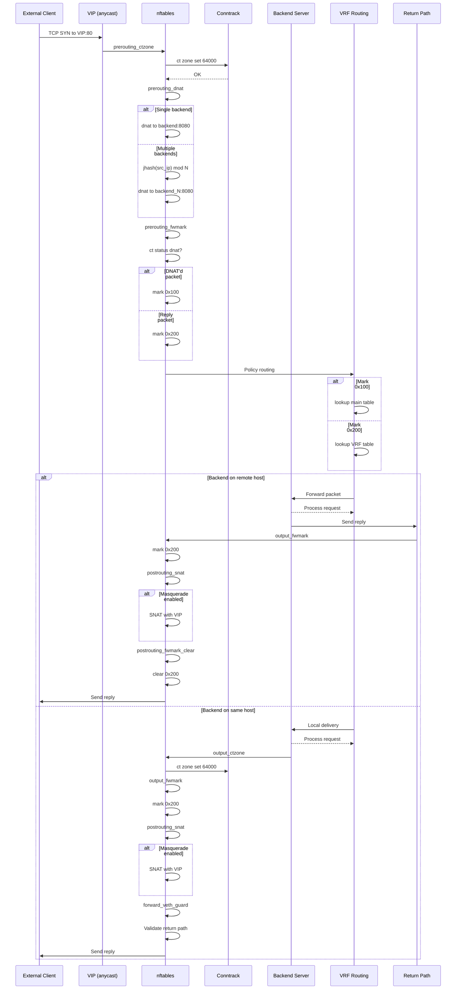

---

## Graceful Shutdown Flow

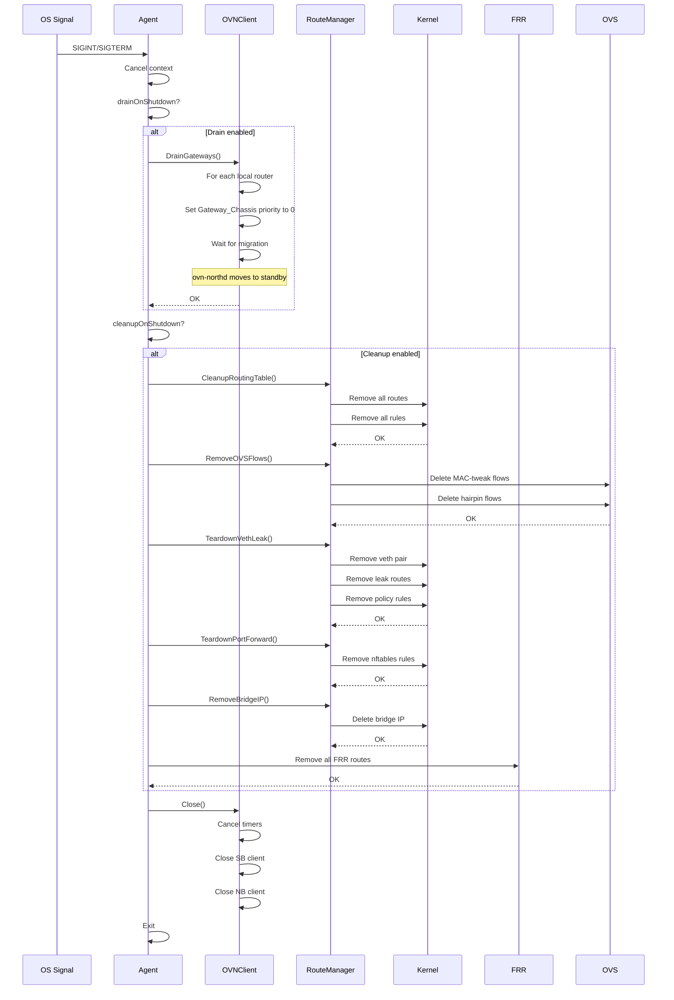

---

## Stale Chassis Cleanup Flow

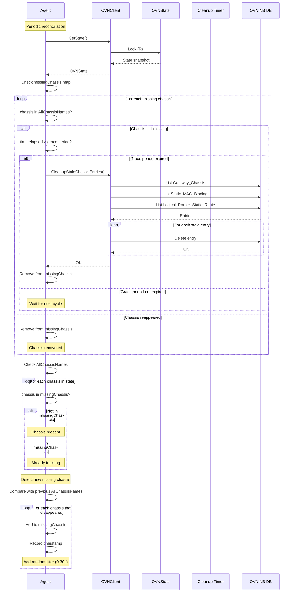

---

## Method Call Sequence - State Refresh

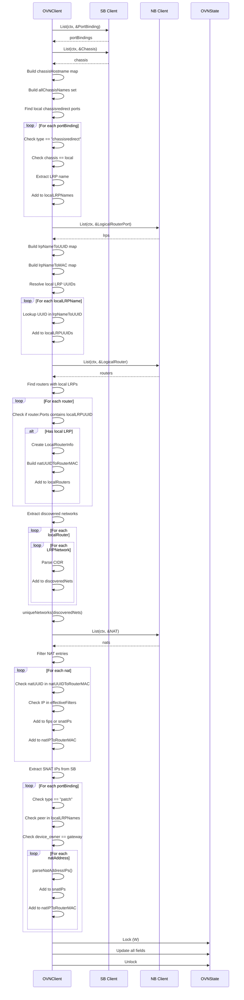

---

## Method Call Sequence - OVS Flow Management

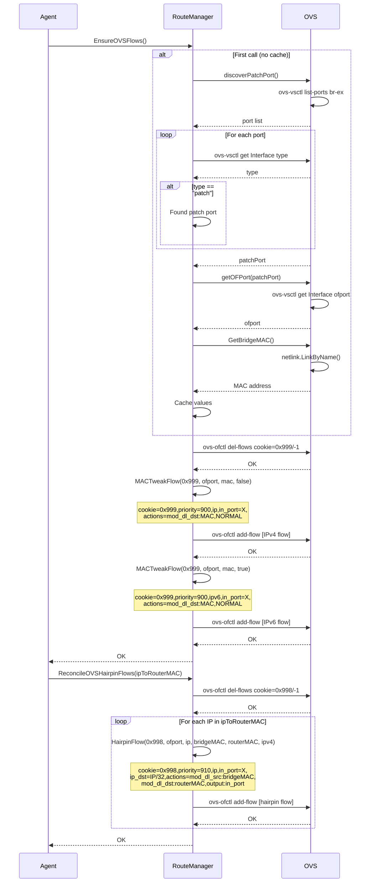

---

## Method Call Sequence - Veth Leak Setup

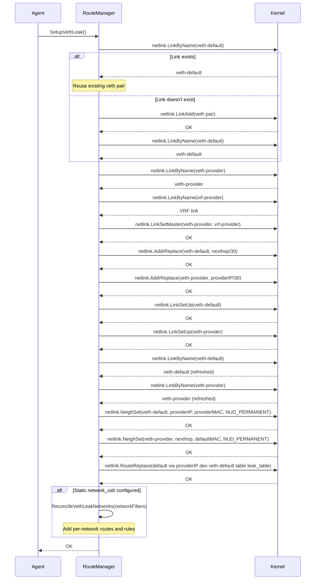
